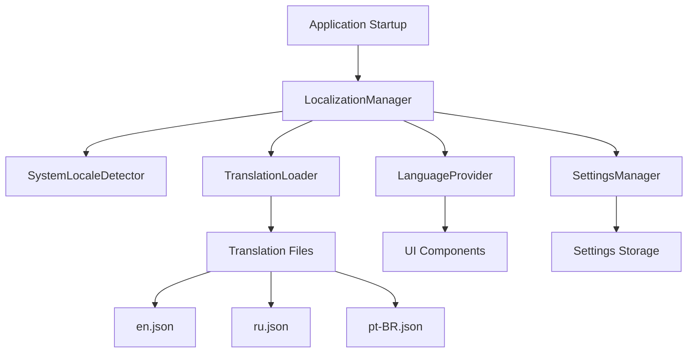

# Design Document

## Overview

Данный документ описывает архитектуру системы локализации для приложения Inspector GGUF. Система будет поддерживать три языка (русский, английский, бразильский португальский) с автоматическим определением системной локали и возможностью ручного переключения языков.

## Architecture

### High-Level Architecture



### Component Interaction Flow

1. **Application Startup**: При запуске приложения инициализируется LocalizationManager
2. **Language Detection**: SystemLocaleDetector определяет системную локаль
3. **Settings Loading**: SettingsManager загружает сохраненные пользовательские настройки
4. **Translation Loading**: TranslationLoader загружает соответствующие переводы
5. **UI Rendering**: LanguageProvider предоставляет переводы компонентам UI

## Components and Interfaces

### 1. LocalizationManager

Центральный компонент системы локализации.

```rust
pub struct LocalizationManager {
    current_language: Language,
    translations: HashMap<Language, TranslationMap>,
    settings_manager: SettingsManager,
    translation_loader: TranslationLoader,
}

impl LocalizationManager {
    pub fn new() -> Result<Self, LocalizationError>;
    pub fn get_text(&self, key: &str) -> &str;
    pub fn set_language(&mut self, language: Language) -> Result<(), LocalizationError>;
    pub fn get_current_language(&self) -> Language;
    pub fn get_available_languages(&self) -> Vec<Language>;
}
```

### 2. Language Enum

Перечисление поддерживаемых языков.

```rust
#[derive(Debug, Clone, Copy, PartialEq, Eq, Hash, Serialize, Deserialize)]
pub enum Language {
    English,
    Russian,
    PortugueseBrazilian,
}

impl Language {
    pub fn from_locale(locale: &str) -> Option<Self>;
    pub fn to_code(&self) -> &'static str;
    pub fn display_name(&self) -> &'static str;
}
```

### 3. TranslationLoader

Компонент для загрузки переводов из файлов.

```rust
pub struct TranslationLoader;

impl TranslationLoader {
    pub fn load_translation(&self, language: Language) -> Result<TranslationMap, LoadError>;
    pub fn validate_translation(&self, translation: &TranslationMap) -> Result<(), ValidationError>;
}
```

### 4. SystemLocaleDetector

Компонент для определения системной локали.

```rust
pub struct SystemLocaleDetector;

impl SystemLocaleDetector {
    pub fn detect() -> Option<Language>;
    pub fn get_system_locale_string() -> Option<String>;
}
```

### 5. SettingsManager

Управление пользовательскими настройками.

```rust
pub struct SettingsManager {
    settings_path: PathBuf,
}

impl SettingsManager {
    pub fn new() -> Result<Self, SettingsError>;
    pub fn load_language_preference(&self) -> Option<Language>;
    pub fn save_language_preference(&self, language: Language) -> Result<(), SettingsError>;
    pub fn get_settings_path(&self) -> &Path;
}
```

### 6. LanguageProvider

Trait для компонентов, которые предоставляют локализованный текст.

```rust
pub trait LanguageProvider {
    fn t(&self, key: &str) -> &str;
    fn t_with_args(&self, key: &str, args: &[&str]) -> String;
}
```

## Data Models

### Translation File Structure

Переводы будут храниться в JSON файлах со следующей структурой:

```json
{
  "app": {
    "title": "Inspector GGUF",
    "version": "Version"
  },
  "buttons": {
    "load": "Load",
    "clear": "Clear",
    "export": "Export",
    "settings": "Settings",
    "about": "About",
    "close": "Close",
    "copy": "Copy",
    "view": "View"
  },
  "menu": {
    "file": "File",
    "export": "Export",
    "settings": "Settings",
    "help": "Help"
  },
  "export": {
    "csv": "CSV",
    "yaml": "YAML",
    "markdown": "MD",
    "html": "HTML",
    "pdf": "PDF"
  },
  "messages": {
    "loading": "Loading file...",
    "no_metadata": "No metadata available",
    "export_failed": "Export failed: {0}",
    "file_open_error": "Failed to open file: {0}",
    "parsing_error": "GGUF parsing error: {0}"
  },
  "settings": {
    "title": "Settings",
    "language": "Language",
    "language_description": "Select interface language"
  },
  "about": {
    "title": "About Inspector GGUF",
    "description": "A powerful GGUF file inspection tool",
    "built_with": "Built with Rust and egui",
    "license": "License: MIT",
    "copyright": "© 2025 FerrisMind",
    "check_updates": "Check for updates",
    "github": "GitHub"
  },
  "languages": {
    "english": "English",
    "russian": "Русский",
    "portuguese_brazilian": "Português (Brasil)"
  }
}
```

### Settings File Structure

Настройки будут храниться в JSON файле:

```json
{
  "language": "Russian",
  "version": "1.0"
}
```

## Error Handling

### Error Types

```rust
#[derive(Debug, thiserror::Error)]
pub enum LocalizationError {
    #[error("Translation file not found for language: {0:?}")]
    TranslationNotFound(Language),
    
    #[error("Invalid translation file format: {0}")]
    InvalidFormat(String),
    
    #[error("Translation key not found: {0}")]
    KeyNotFound(String),
    
    #[error("Settings error: {0}")]
    Settings(#[from] SettingsError),
    
    #[error("IO error: {0}")]
    Io(#[from] std::io::Error),
}

#[derive(Debug, thiserror::Error)]
pub enum SettingsError {
    #[error("Failed to create settings directory")]
    DirectoryCreation,
    
    #[error("Failed to read settings file")]
    ReadError,
    
    #[error("Failed to write settings file")]
    WriteError,
    
    #[error("Invalid settings format")]
    InvalidFormat,
}
```

### Error Recovery Strategies

1. **Missing Translation Files**: Fallback to English if requested language file is missing
2. **Missing Translation Keys**: Return key name as fallback text
3. **Settings File Corruption**: Create new settings file with default values
4. **System Locale Detection Failure**: Default to English language

## Testing Strategy

### Unit Tests

1. **LocalizationManager Tests**:
   - Language switching functionality
   - Translation key retrieval
   - Fallback behavior for missing keys

2. **TranslationLoader Tests**:
   - Loading valid translation files
   - Handling malformed JSON files
   - Validation of translation completeness

3. **SystemLocaleDetector Tests**:
   - Locale detection on different platforms
   - Handling unsupported locales
   - Fallback behavior

4. **SettingsManager Tests**:
   - Saving and loading language preferences
   - Handling missing settings files
   - Settings file corruption recovery

### Integration Tests

1. **End-to-End Language Switching**:
   - Test complete flow from language selection to UI update
   - Verify persistence across application restarts

2. **Translation Completeness**:
   - Verify all UI elements have translations in all languages
   - Check for missing translation keys

3. **Platform Compatibility**:
   - Test locale detection on Windows, macOS, and Linux
   - Verify settings persistence across platforms

### Performance Considerations

1. **Translation Loading**: Load translations once at startup, cache in memory
2. **Key Lookup**: Use HashMap for O(1) translation key lookup
3. **Memory Usage**: Lazy loading of translations for unused languages
4. **UI Updates**: Batch UI updates when switching languages to avoid flickering

## Implementation Notes

### File Organization

```
src/
├── localization/
│   ├── mod.rs
│   ├── manager.rs
│   ├── language.rs
│   ├── loader.rs
│   ├── detector.rs
│   ├── settings.rs
│   └── provider.rs
├── translations/
│   ├── en.json
│   ├── ru.json
│   └── pt-BR.json
└── gui.rs (modified)
```

### Integration with Existing Code

1. **GgufApp Structure**: Add LocalizationManager field
2. **UI Components**: Replace hardcoded strings with translation calls
3. **Settings Dialog**: Add language selection dropdown
4. **Error Messages**: Localize all error messages and notifications

### Platform-Specific Considerations

1. **Windows**: Use Windows API for locale detection
2. **macOS/Linux**: Use environment variables (LANG, LC_ALL)
3. **Settings Storage**: Use platform-appropriate directories (AppData on Windows, ~/.config on Linux)

### Future Extensibility

1. **Plugin Architecture**: Design allows easy addition of new languages
2. **Translation Management**: Structure supports external translation tools
3. **RTL Support**: Architecture can be extended for right-to-left languages
4. **Pluralization**: Framework can be extended to support plural forms