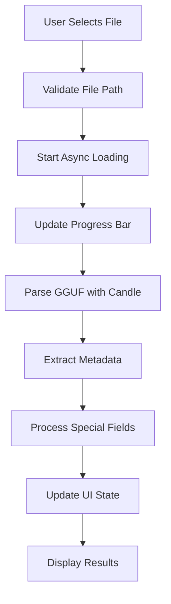
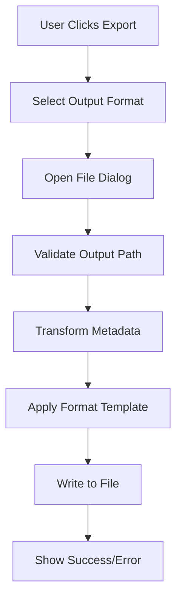
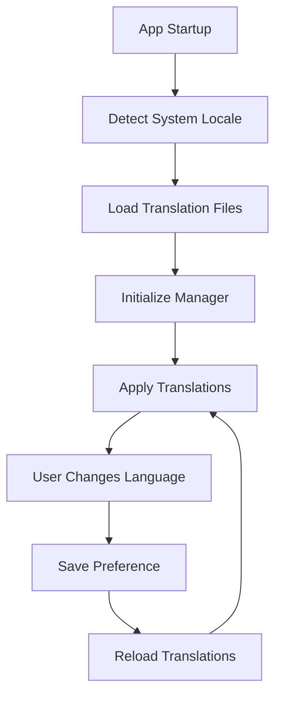

# Inspector GGUF Architecture Documentation

This document provides a comprehensive overview of the Inspector GGUF application architecture, design decisions, and implementation details.

## 🏗️ High-Level Architecture

Inspector GGUF follows a modular, layered architecture designed for maintainability, testability, and extensibility.

```
┌─────────────────────────────────────────────────────────────┐
│                    User Interface Layer                     │
├─────────────────────────────────────────────────────────────┤
│  GUI Components  │  CLI Interface  │  Localization System  │
├─────────────────────────────────────────────────────────────┤
│                   Application Logic Layer                   │
├─────────────────────────────────────────────────────────────┤
│  Export System   │  File Loading   │  Theme Management     │
├─────────────────────────────────────────────────────────────┤
│                     Data Layer                             │
├─────────────────────────────────────────────────────────────┤
│  GGUF Parser     │  Metadata Store │  Configuration        │
└─────────────────────────────────────────────────────────────┘
```

## 📁 Module Structure

### Core Modules

#### `src/main.rs`
- **Purpose**: Application entry point and CLI argument parsing
- **Responsibilities**:
  - Command-line argument processing
  - Application mode selection (GUI/CLI)
  - System initialization
  - Icon loading and window configuration

#### `src/lib.rs`
- **Purpose**: Library exports and public API
- **Responsibilities**:
  - Module organization
  - Public interface definition
  - Re-exports for external usage

#### `src/format.rs`
- **Purpose**: GGUF file format handling
- **Responsibilities**:
  - GGUF file parsing using Candle library
  - Metadata extraction and processing
  - Error handling for malformed files
  - Async loading support

### GUI System (`src/gui/`)

#### `src/gui/app.rs`
- **Purpose**: Main application state and eframe::App implementation
- **Key Components**:
  ```rust
  pub struct GgufApp {
      pub metadata: Vec<MetadataEntry>,
      pub filter: String,
      pub loading: bool,
      pub loading_progress: Arc<Mutex<f32>>,
      pub loading_result: LoadingResult,
      pub show_settings: bool,
      pub show_about: bool,
      pub selected_chat_template: Option<String>,
      pub selected_ggml_tokens: Option<String>,
      pub selected_ggml_merges: Option<String>,
      pub update_status: Option<String>,
      pub localization_manager: LocalizationManager,
  }
  ```

#### `src/gui/theme.rs`
- **Purpose**: UI theming and visual consistency
- **Features**:
  - Color palette management
  - Font loading and configuration
  - Theme application across components
  - Inspector Gadget-inspired color scheme

#### `src/gui/layout.rs`
- **Purpose**: Responsive layout utilities
- **Functions**:
  - `get_sidebar_width()` - Adaptive sidebar sizing
  - `get_adaptive_font_size()` - Screen-responsive font scaling
  - `get_adaptive_button_width()` - Dynamic button sizing

#### `src/gui/panels/`
Panel system for modular UI components:

- **`sidebar.rs`** - Left sidebar with action buttons and export options
- **`content.rs`** - Main content area with metadata display
- **`dialogs.rs`** - Modal dialogs and right-side panels

#### `src/gui/export.rs`
- **Purpose**: Multi-format export functionality
- **Supported Formats**:
  - CSV - Comma-separated values
  - YAML - Human-readable data serialization
  - Markdown - Documentation format
  - HTML - Web-compatible format
  - PDF - Portable document format
- **Features**:
  - Error handling and validation
  - File extension management
  - Base64 encoding for binary data

#### `src/gui/loader.rs`
- **Purpose**: Asynchronous file loading
- **Features**:
  - Background loading with progress tracking
  - Thread-safe result handling
  - Error propagation and user feedback

#### `src/gui/updater.rs`
- **Purpose**: Application update checking
- **Features**:
  - GitHub API integration
  - Version comparison using semver
  - User notification system

### Localization System (`src/localization/`)

#### `src/localization/manager.rs`
- **Purpose**: Central localization management
- **Features**:
  - Language switching
  - Translation caching
  - Fallback handling
  - Persistent settings

#### `src/localization/loader.rs`
- **Purpose**: Translation file loading and validation
- **Features**:
  - JSON translation parsing
  - Translation completeness checking
  - Error handling for missing translations

#### `src/localization/detector.rs`
- **Purpose**: System locale detection
- **Platform Support**:
  - Windows locale detection
  - Unix/Linux locale parsing
  - Fallback to English

#### `src/localization/language.rs`
- **Purpose**: Language definitions and metadata
- **Supported Languages**:
  ```rust
  pub enum Language {
      English,
      Russian,
      PortugueseBrazilian,
  }
  ```

## 🔄 Data Flow

### File Loading Process


### Export Process


### Localization Flow


## 🧵 Threading Model

### Main Thread
- UI rendering and event handling
- User interaction processing
- State management

### Background Threads
- File loading operations
- Export processing
- Update checking
- Profiling data collection

### Thread Safety
- `Arc<Mutex<T>>` for shared state
- Message passing for thread communication
- Atomic operations for simple flags

## 🎨 UI Architecture

### Component Hierarchy
```
GgufApp (Root)
├── SidePanel (Left)
│   ├── Load Button
│   ├── Clear Button
│   ├── Export Buttons
│   │   ├── CSV Export
│   │   ├── YAML Export
│   │   ├── Markdown Export
│   │   ├── HTML Export
│   │   └── PDF Export
│   ├── Settings Button
│   └── About Button
├── CentralPanel (Main)
│   ├── Progress Bar
│   ├── Filter Controls
│   └── Metadata Display
│       ├── Key-Value Pairs
│       ├── Special Viewers
│       │   ├── Chat Template
│       │   ├── GGML Tokens
│       │   └── GGML Merges
│       └── Binary Data Handlers
└── Modal Dialogs
    ├── Settings Dialog
    ├── About Dialog
    └── Right-Side Panels
```

### State Management
- **Centralized State**: All application state in `GgufApp` struct
- **Immutable Updates**: State changes through controlled mutations
- **Event-Driven**: UI updates triggered by user actions
- **Reactive**: Automatic UI refresh on state changes

## 🔧 Configuration System

### Settings Storage
- **Location**: Platform-specific user directories
- **Format**: JSON configuration files
- **Scope**: User preferences and application state

### Configurable Options
- Interface language
- Window size and position
- Export preferences
- Update check frequency

## 🚀 Performance Considerations

### Memory Management
- **Lazy Loading**: Load metadata only when needed
- **Streaming**: Process large files in chunks
- **Caching**: Cache frequently accessed data
- **Cleanup**: Automatic resource cleanup

### Optimization Strategies
- **Async Operations**: Non-blocking file I/O
- **Progress Tracking**: User feedback during long operations
- **Efficient Rendering**: Minimal UI redraws
- **Memory Pools**: Reuse allocated memory

### Profiling Integration
- **Puffin Profiler**: Built-in performance monitoring
- **HTTP Server**: Web-based profiling interface
- **Metrics Collection**: Detailed performance data

## 🛡️ Error Handling

### Error Categories
1. **File System Errors**: Permission, not found, corruption
2. **Parsing Errors**: Invalid GGUF format, unsupported versions
3. **Export Errors**: Write failures, format issues
4. **Network Errors**: Update check failures
5. **UI Errors**: Rendering issues, state corruption

### Error Handling Strategy
```rust
// Custom error types with context
#[derive(thiserror::Error, Debug)]
pub enum InspectorError {
    #[error("Failed to load GGUF file: {0}")]
    LoadError(String),
    
    #[error("Export failed: {0}")]
    ExportError(String),
    
    #[error("Localization error: {0}")]
    LocalizationError(String),
}

// Result type alias
pub type Result<T> = std::result::Result<T, InspectorError>;
```

### Recovery Mechanisms
- **Graceful Degradation**: Continue operation with reduced functionality
- **User Feedback**: Clear error messages with suggested actions
- **Logging**: Detailed error logging for debugging
- **Fallbacks**: Alternative approaches when primary methods fail

## 🧪 Testing Architecture

### Test Categories
1. **Unit Tests**: Individual function testing
2. **Integration Tests**: Component interaction testing
3. **UI Tests**: User interface behavior testing
4. **Localization Tests**: Translation system testing

### Test Organization
```
src/
├── gui/
│   ├── export.rs
│   └── tests/           # Unit tests inline
├── localization/
│   ├── loader.rs
│   └── tests/           # Unit tests inline
└── tests/               # Integration tests
    ├── gui_tests.rs
    ├── export_tests.rs
    └── localization_tests.rs
```

### Testing Utilities
- **Mock Data**: Standardized test datasets
- **Temporary Files**: Safe file system testing
- **UI Simulation**: Automated UI interaction testing

## 🔮 Future Architecture Considerations

### Planned Enhancements
1. **Plugin System**: Extensible functionality through plugins
2. **Database Integration**: Metadata caching and indexing
3. **Cloud Integration**: Remote file access and sharing
4. **Advanced Analytics**: Statistical analysis of model metadata

### Scalability Improvements
1. **Streaming Parser**: Handle extremely large files
2. **Distributed Processing**: Multi-threaded parsing
3. **Memory Optimization**: Reduced memory footprint
4. **Performance Monitoring**: Real-time performance metrics

### Architecture Evolution
1. **Microservices**: Separate concerns into services
2. **Event Sourcing**: Audit trail for all operations
3. **CQRS**: Command-Query Responsibility Segregation
4. **Reactive Architecture**: Event-driven system design

---

This architecture documentation is maintained alongside the codebase and updated with each significant architectural change.